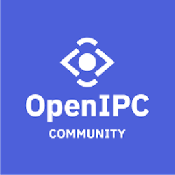
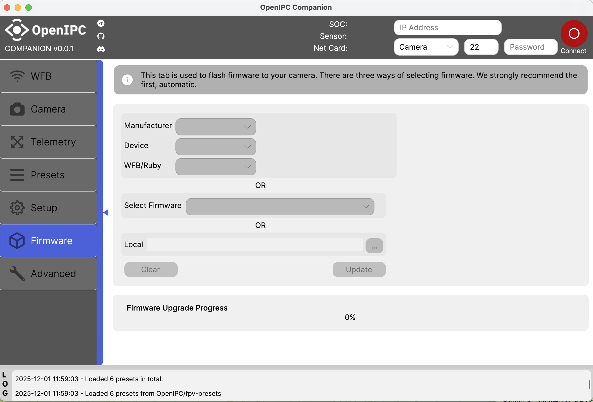

# Companion



An official multi-platform configuration tool for OpenIPC cameras, built with Avalonia UI. The app manages camera settings, telemetry, presets, and firmware updates.

[][telegram]

[Demo on YouTube](https://www.youtube.com/watch?v=iJXXMcnOC7w)

* Mobile builds are in progress.

**Note: NVR is not supported yet. Please use MarioFPV's [OpenIPC Config](https://github.com/OpenIPC/configurator) for NVR support.**

## Features

* **Camera settings management**: configure resolution, frame rate, and exposure
* **Telemetry**: view real-time metrics like temperature, voltage, and signal strength
* **Setup wizards**: guided setup for device and network configuration
* **Multi-platform support**: Windows, macOS, Linux, Android, and iOS targets
* **YAML-based configuration files**: edit and customize settings with YAML

## Getting started (desktop)

```bash
dotnet build Companion.Desktop/Companion.Desktop.csproj -c Release
dotnet run --project Companion.Desktop/Companion.Desktop.csproj
```

## Documentation

- [Configuration and logging](docs/configuration.md)
- [Presets](docs/presets.md)
- [Project structure](docs/architecture.md)
- [Linux guide](docs/platforms/linux.md)
- [Android guide](docs/platforms/android.md)
- [Development and release workflow](docs/development.md)



[chat]: https://openipc.org/our-channels
[contribution]: https://opencollective.com/openipc/contribute/backer-14335/checkout

[firmware]: https://github.com/openipc/firmware
[logo]: https://openipc.org/assets/openipc-logo-black.svg
[mit]: https://opensource.org/license/mit
[opencollective]: https://opencollective.com/openipc
[paypal]: https://www.paypal.com/donate/?hosted_button_id=C6F7UJLA58MBS
[project]: https://github.com/openipc
[telegram]: https://openipc.org/our-channels
[website]: https://openipc.org
[wiki]: https://github.com/openipc/wiki
